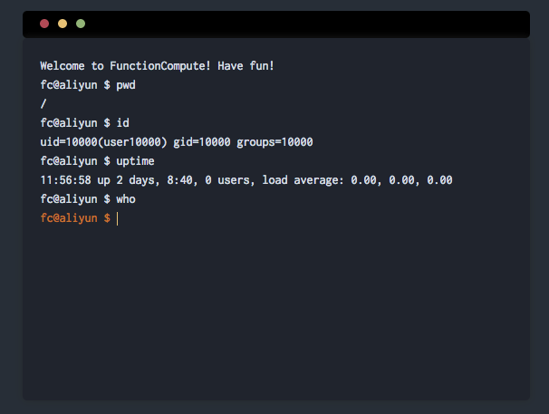

# When FC meets websocket...

Develop an instant co-editor with ONLY [133 lines of code](code/index.js). Serverless, free-tier, pay-as-your-usage, and... Did we mention it also scales?

Powered by Aliyun [FunctionCompute](https://www.aliyun.com/product/fc) & [ApiGateway](https://www.aliyun.com/product/apigateway)



Demo - http://fc-public.oss-cn-hangzhou.aliyuncs.com/demo/co-edit/index.html?id=fc

### Run

```
$ npm install
$ npm run dist
$ open index.html
```

### Dev

```
$ npm install
$ npm run watch
```

### TODO

- [ ] responsive page for mobile
